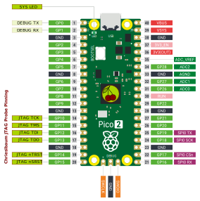

<h1 align="center">
Chriesibaum's JTAG Probe Firmware
</h1>

The Chriesibaum JTAG Probe is a USB device that provides a KISS as well rock solid JTAG interface. The probe is designed to run effortless and simple JTAG boundary scanns. The probe can be used in conjunction with the python module [cb_jtag](https://github.com/chriesibaum/cb_jtag).


# Overview

The probe can basically be used on any microcontroller that has a USB interface and a handful of GPIO pins. At the moment the firmware is runnuning and tested on the following boards:
- [Raspberry Pi Pico 2](https://docs.zephyrproject.org/latest/boards/raspberrypi/rpi_pico2/doc/index.html)
- [Raspberry Pi Pico](https://docs.zephyrproject.org/latest/boards/raspberrypi/rpi_pico/doc/index.html)

Is your board missing? - Just contact me and we can provide a port for you.


# Pinnout



# Getting Started

- Flash the uf2 binnary image to the Raspberry Pi Pico
- Install the udev rule to be able to connect to the Chriesibaum JTAG Probe
- Connect the JTAG signals to your target
- Run the examples ```cb_jtag_probe_example.py``` or ```cb_jtag_probe_read_idcodes.py```
- Adjust the example script from [cb_jtag](https://github.com/chriesibaum/cb_jtag) to your target and run it.

This is running perfectly on Ubuntu 24.04 and should work out of the box on other Linux systems.


## About Café - The Heart of Coding! ;-)

Do you like this project and want to support it?
I appreciate every single Café – it keeps me going!
You can also sponsor the project on
[github sponsors](https://github.com/sponsors/chriesibaum/)? Thanks for your support!

<div align="center">
<a href="https://www.buymeacoffee.com/chriesibaum" target="_blank">
</a>

</div>